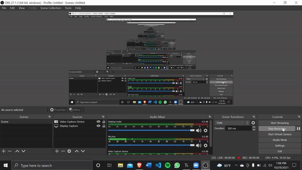

# Memorama

## Integrantes:
- Samuel Acosta
- Ricardo Olmedo

## Video Reflexion:
https://www.youtube.com/watch?v=J3oh6vB2UQ4

## Cosas que se realizaron
- Agregar codigo inicial y README inicial
- Contar y desplegar el numero de taps
- Detectar cuando todos los cuadros se han destapado
- Utilizar algo diferente a los dígitos para resolver el juego y que al usuario le ayude a tener mejor memoria

## Agregar codigo inicial y README inicial

´´´python
"""Memory, puzzle game of number pairs.

Exercises:

1. Count and print how many taps occur.
2. Decrease the number of tiles to a 4x4 grid.
3. Detect when all tiles are revealed.
4. Center single-digit tile.
5. Use letters instead of tiles.

"""

from random import *
from turtle import *

from freegames import path

car = path('car.gif')
tiles = list(range(32)) * 2
state = {'mark': None}
# lista indica cantidad de cartas escondidas
hide = [True] * 64

def square(x, y):
    "Draw white square with black outline at (x, y)."
    up()
    goto(x, y)
    down()
    color('black', 'cyan')
    begin_fill()
    for count in range(4):
        forward(50)
        left(90)
    end_fill()

def index(x, y):
    "Convert (x, y) coordinates to tiles index."
    return int((x + 200) // 50 + ((y + 200) // 50) * 8)

def xy(count):
    "Convert tiles count to (x, y) coordinates."
    return (count % 8) * 50 - 200, (count // 8) * 50 - 200

def tap(x, y):
    "Update mark and hidden tiles based on tap."
    #se obtiene el indice sobre la cual se dio click
    spot = index(x, y)
    #obtiene el estado actual del memo
    mark = state['mark']

    # Verifica si no son pares deja en state la ultima carta seleccionada
    if mark is None or mark == spot or tiles[mark] != tiles[spot]:
        state['mark'] = spot
    else:
        # son pares, se hace visible poniendo False e inicializa state en None
        hide[spot] = False
        hide[mark] = False
        state['mark'] = None

def draw():
    "Draw image and tiles."
    clear()
    goto(0, 0)
    shape(car)
    stamp()

    # ciclo que dibuja las cartas que estan ocultas
    # inicando en la esquina inferior izquierda -200, -200
    for count in range(64):
        if hide[count]:
            x, y = xy(count) # xy(63) x=150 y=150
            square(x, y)

    #mark indica si tenemos una carta visible o None(No)
    mark = state['mark']
    
    # Si fue seleccionada y no esta visible, escribe el valor de la carta
    if mark is not None and hide[mark]:
        x, y = xy(mark)
        up()
        goto(x + 2, y)
        color('black')
        write(tiles[mark], font=('Arial', 30, 'normal'))

    update()
    ontimer(draw, 100)

# desordena las tiles
shuffle(tiles)
# abre la ventana de 420 ancho 420 alto, posicion en donde se abre la pantalla
setup(420, 420, 370, 0)
# Agrega la imagen al canvas al window
addshape(car)
# Oculta la tortuga osea la flecha
hideturtle()
# Es para que no se vea el trazado de cada cuadro
tracer(False)
# activar la funcion que atiende los eventos del mouse
onscreenclick(tap)
draw()
done()

## Contar y desplegar el numero de taps
def draw():
    "Draw image and tiles."
    clear()
    goto(0, 0)
    shape(car)
    stamp()
    up()
    goto(0, 200)
    color('red')
    write("Numero de taps: "+str(i))
    update()
    # ciclo que dibuja las cartas que estan ocultas
    # inicando en la esquina inferior izquierda -200, -200
    for count in range(64):
        if hide[count]:
            x, y = xy(count) # xy(63) x=150 y=150
            square(x, y)

    #mark indica si tenemos una carta visible o None(No)
    mark = state['mark']
    
## Detectar cuando todos los cuadros se han destapado
contar_pares=0
global i, contar_pares
contar_pares+=1
if contar_pares==32:
        up()
        goto(-100, 200)
        color('purple')
        write("GANASTE")

## Utilizar algo diferente a los dígitos para resolver el juego y que al usuario le ayude a tener mejor memoria
['fresa','manzana','banana','naranja','durazno','sandia','melon','limon','coco','kiwi','cereza','ciruela','mora','uva','pera','mango','papaya','frambuesa','pina','toronja','aguacate','arandanos','granadas','aceitunas','guayava','avellana','almendra','cacahuate','carambola','pepino','zapote','tamarindo']
list(range(32))

## GIF del Programa

